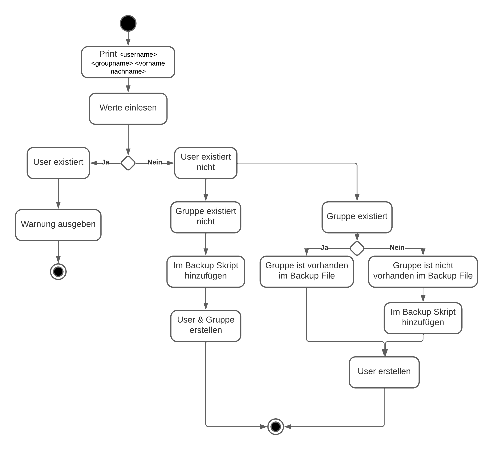
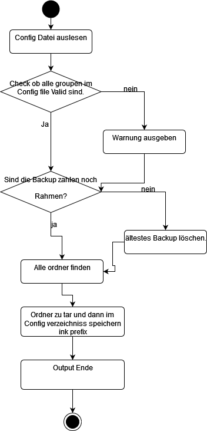

# Projekt Dokumentation

[[_TOC_]]

## Lösungsdesign
Anhand der Analyse wurde folgendes Lösungsdesign entworfen.

### Aufruf der Skripte

TODO: schreiben sie wie die Skripte aufgerufen werden sollen (d.h. welche Parameter werden übergeben, gibt es Interaktionen mit dem Skript, läuft es automatisch täglich ab?)

### Ablauf der Automation

TODO: Hier kommt ihr UML-Activity Diagramm

Task 1:

Task 2:

### Konfigurationsdateien

TODO: Definieren sie welche Parameter in welchen Konfigurationsdateien gespeichert werden.

Task 1: <username> <groupname> <vorname nachname>
Dies sind die Benötigten Parameter, die mitgegeben werden müssen. Sie werden verwendet, um die User zu erstellen.

Task 2: Keine  müssen definirt werden. Alles Configurationen sind im externen Config File zu definiren.

## Abgrenzungen zum Lösungsdesign

TODO: Nachdem das Programm verwirklicht wurde, hier die Unterschiede von der Implementation zum Lösungsdesign beschreiben (was wurde anders gemacht, was wurde nicht gemacht, was wurde zusaetzlich gemacht)